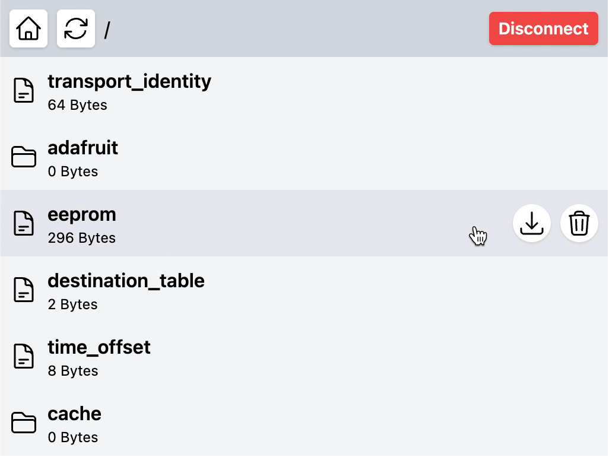

# nRF52 BLE File Manager

A simple file manager (over BLE) for nRF52 based boards, such as the RAK4631.

It allows you to browse, download and delete files stored in `InternalFS` / `LittleFS` flash memory on your nRF52 based microcontroller by connecting to it via Bluetooth in a web browser.



## Setup

- Add `BLEFileManager.h` to your Arduino or PlatformIO project.
- Ensure you add the `ArduinoJson` library dependency to your project.
- Add the following code snippet to initialise the BLE file server.
- Once your microcontroller has been flashed, launch `index.html` in a web browser.
- Click connect and select `nRF52 File Manager` from the device list.

```
#include "BLEFileManager.h"
BLEFileManager bleFileManager;

void setup() {
    bleFileManager.begin();
}
```

## Warning

- The BLE service does not currently implement any security.
- Any one can connect and manage files on the device.
- This should not be used in production, only for debug purposes.
- If you decide to use in production, you should at least add Bluetooth pin authentication.

## License

MIT
